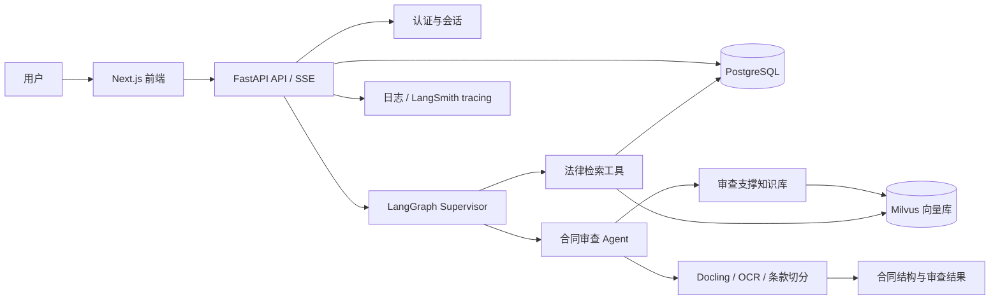
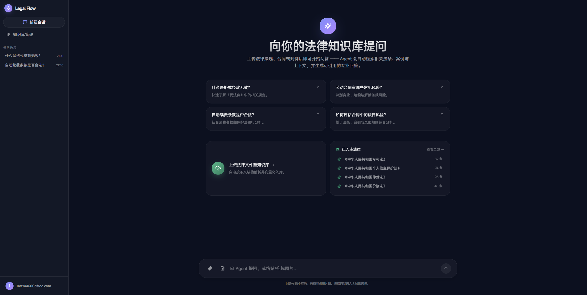
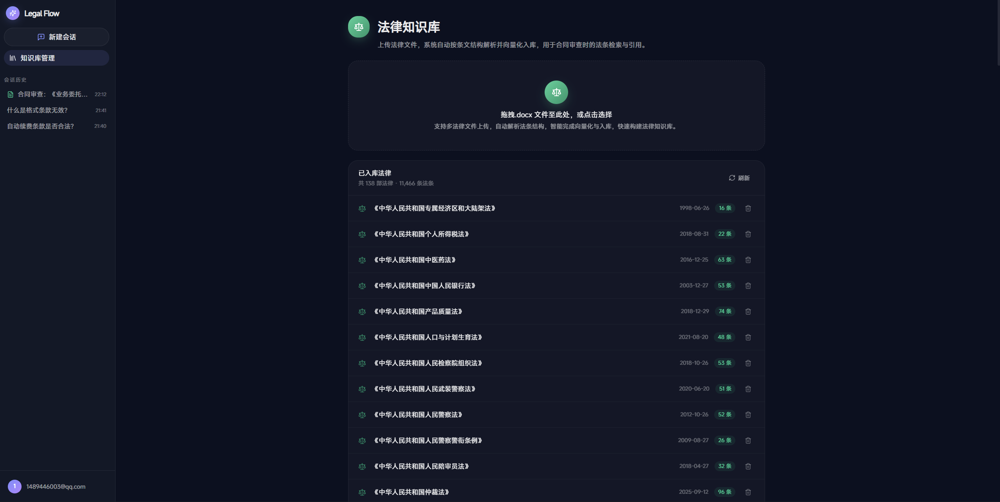
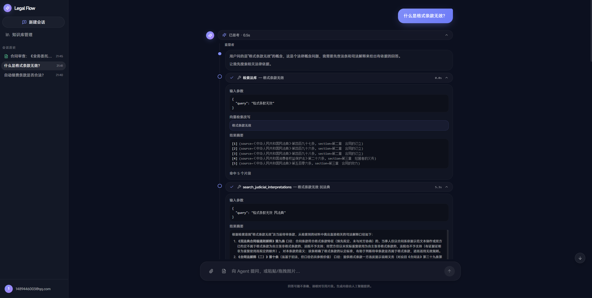
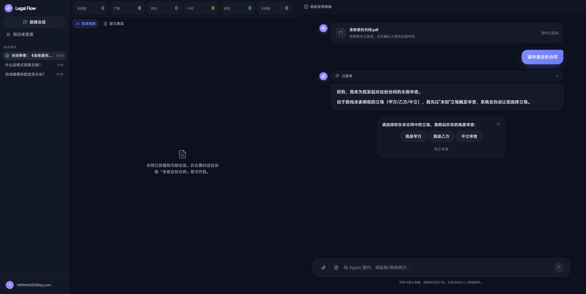
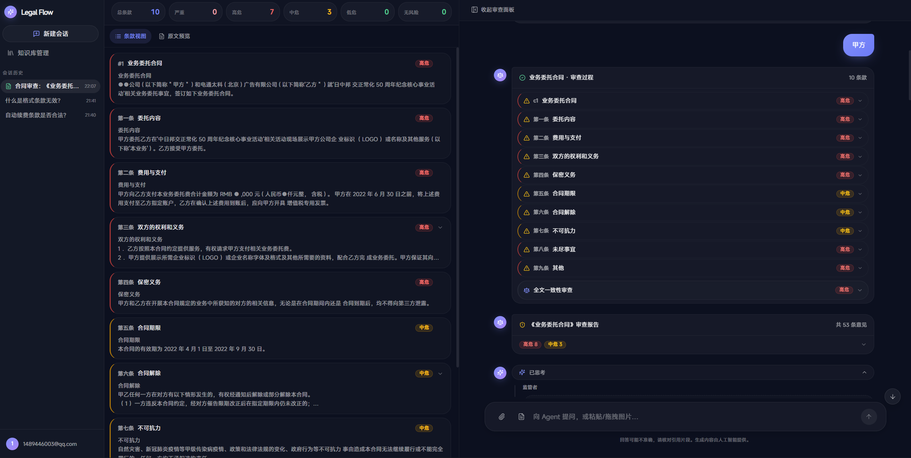
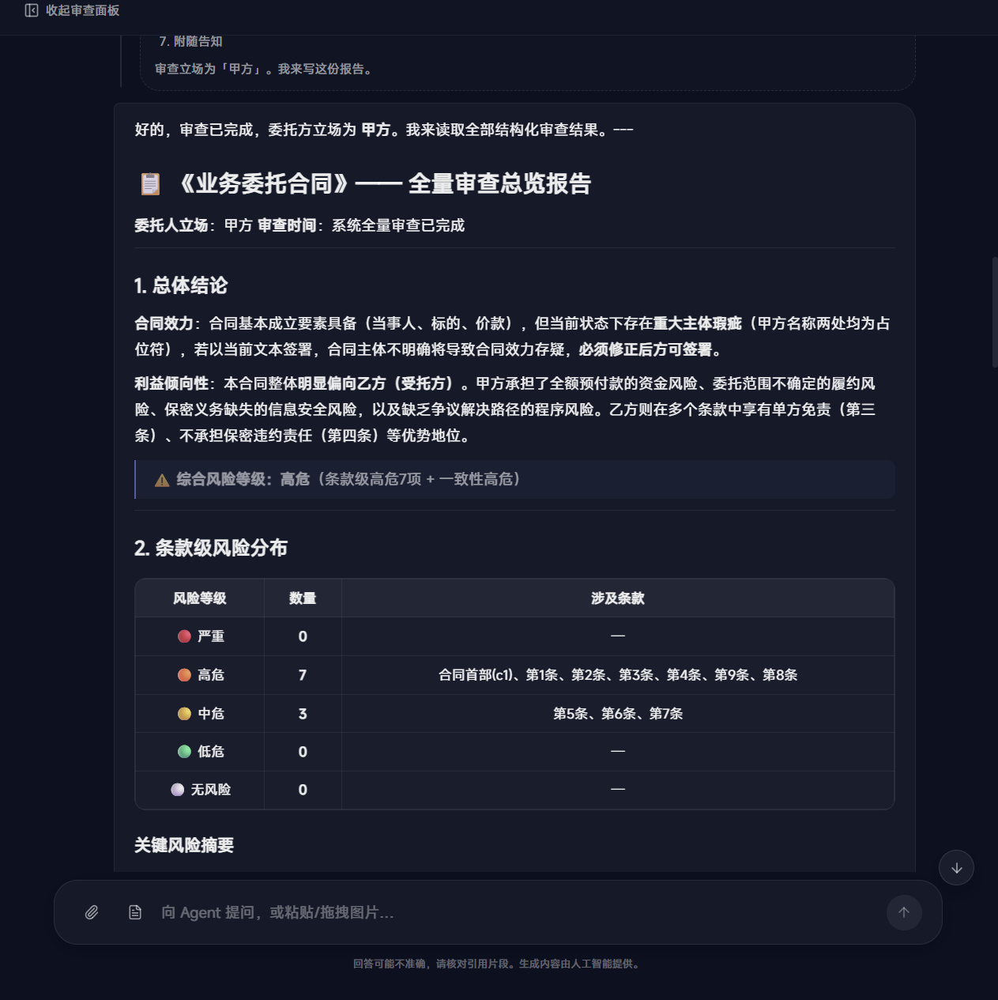
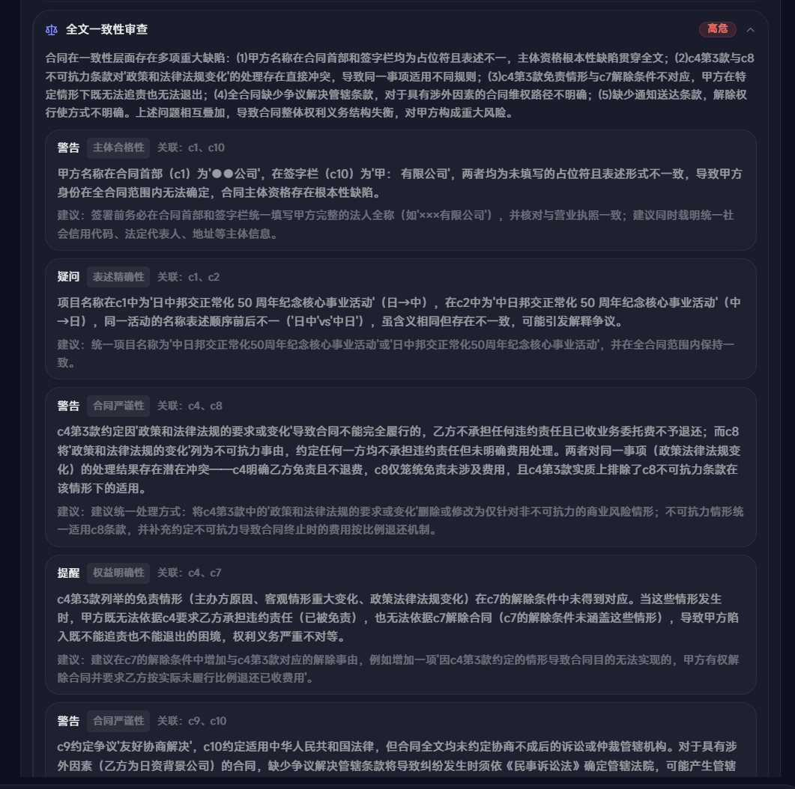
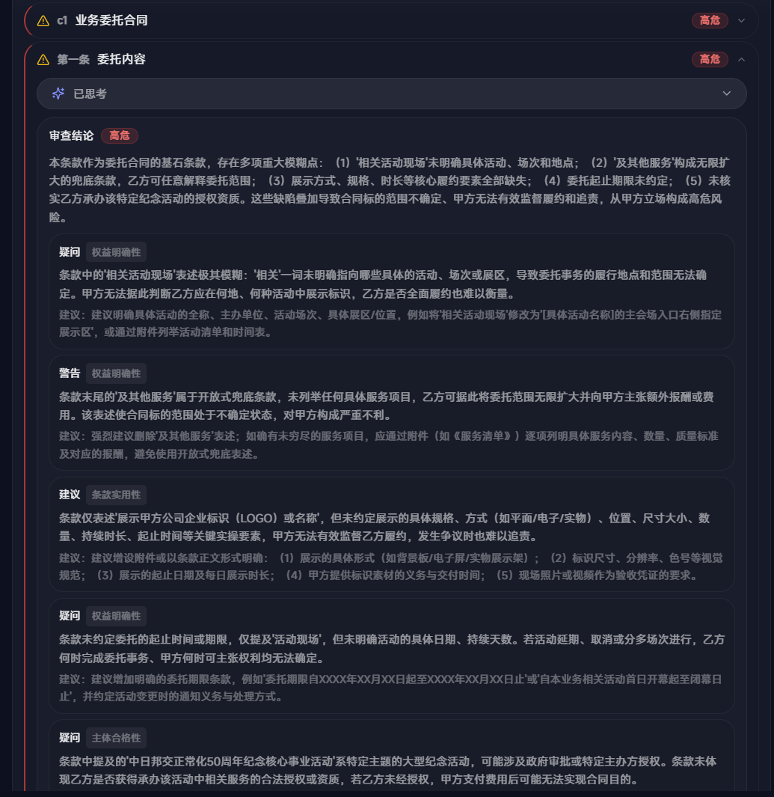

# Legal Flow

<p align="center">
  <strong>面向中文法律问答、合同审查与法律知识库工程化落地的 Agent 系统</strong>
</p>

<p align="center">
  <a href="https://github.com/cyber1026/legal-flow/actions/workflows/ci.yml"></a>
  
  
  
  
</p>

Legal Flow 是一套围绕中文法律场景设计的端到端系统：后端使用 FastAPI、LangGraph、Milvus、PostgreSQL 和 BGE-M3 embedding，前端使用 Next.js 16、React 19、Tailwind CSS v4 和 shadcn 风格组件，覆盖法律知识库管理、可追踪法律问答、合同条款切分、立场确认、逐条审查、全文一致性审查和评测数据集。

> 重要提示：本项目输出仅用于辅助检索、审阅和研究，不构成法律意见。生产使用前必须引入律师复核、权限隔离、审计日志和数据合规流程。

## 功能亮点

- **中文法律知识库问答**：支持法律法规、司法解释、指导案例、实务指引和示范合同等多层语料检索，回答保留引用来源。
- **合同智能审查**：上传 PDF / DOCX 解析合同结构，切分条款，按立场输出风险等级、疑问、提醒、建议和法条依据。
- **单条款并行审查**：合同切分后按条款并发执行审查任务，汇总条款级风险、审查意见和全文报告。
- **GraphRAG 法律检索**：结合向量检索、图检索和法律结构化元数据，加强法条、案例的检索效果。
- **多 Agent 工作流**：使用 LangGraph 编排法律检索、合同解析、条款审查和一致性审查节点，支持流程恢复。
- **Human-in-the-loop 立场确认**：合同审查不会臆测甲方、乙方或中立立场，缺失时由用户选择后再继续。
- **全文一致性审查**：除单条款风险外，额外检查主体、金额、期限、解除、保密、争议解决等跨条款冲突。
- **评测体系**：合同单条款风险识别数据集与 baseline / legal-flow 对照实验，关注高风险漏检率等指标。
- **可观测与可恢复**：SSE 事件流、LangGraph checkpoint、审查任务状态、日志和 LangSmith tracing 配置均已预留。


## 架构概览



## 技术栈

| 层级 | 技术 |
| --- | --- |
| 后端 API | FastAPI, Pydantic, SSE |
| Agent 编排 | LangGraph, LangChain, DeepSeek / Gemini / ZhipuAI 兼容层 |
| 检索与知识库 | Milvus, BGE-M3, BM25, 多层法律语料 |
| 数据存储 | PostgreSQL, LangGraph checkpoint |
| 文档解析 | Docling, PaddleOCR, pypdf |
| 前端 | Next.js 16, React 19, TypeScript, Tailwind CSS v4, Zustand |
<!-- | 评测 | pytest, 自研合同风险评测 CLI | -->

## 快速开始

### 环境要求

- Python 3.11
- Node.js 22+
- Docker 与 Docker Compose
- NVIDIA GPU 环境用于本地 BGE-M3 embedding / OCR 加速
- `uv` 作为 Python 包管理器

### 克隆仓库

```bash
git clone --recurse-submodules https://github.com/cyber1026/legal-flow.git
cd legal-flow
```


### 安装依赖

```bash
uv sync

# 合同 PDF/DOCX/图片解析、OCR 和本地 GPU 推理依赖
uv sync --extra contracts

# 运行评测构建/实验需要的额外依赖
uv sync --extra eval

cd frontend/web
npm install
cd ../..
```

### 配置环境变量

```bash
cp .env.example .env
```

最少需要配置：

```bash
LLM_PROVIDER=deepseek
DEEPSEEK_API_KEY=your-deepseek-api-key
DEEPSEEK_MODEL=deepseek-v4-flash
JWT_SECRET=replace-with-a-long-random-secret
```

完整配置入口在 `app/core/config.py`，公开示例见 `.env.example`。

### 启动基础服务

```bash
docker compose up -d
docker compose ps
```

Compose 会启动：

| 服务 | 端口 | 用途 |
| --- | --- | --- |
| PostgreSQL | `5432` | 用户、会话、合同与任务状态 |
| Milvus | `19530` / `9091` | 向量检索与健康检查 |
| MinIO | `9000` / `9001` | Milvus 对象存储 |
| etcd | 内网 | Milvus 元数据 |
| Infinity | `7997` | BGE-M3 embedding 服务 |

### 启动后端

```bash
uv run uvicorn main:app --host 127.0.0.1 --port 8765
```

开发模式：

```bash
uv run uvicorn main:app --reload --reload-dir app --host 127.0.0.1 --port 8765
```

健康检查：

```bash
curl http://127.0.0.1:8765/healthz
```

### 启动前端

```bash
cd frontend/web
npm run dev
```

打开 `http://localhost:3000`。

## 系统截图

| 首页与任务入口 | 法律知识库管理 |
| --- | --- |
|  |  |

| 法律问答检索过程 | 合同审查立场确认 |
| --- | --- |
|  |  |

| 条款风险总览 | 全量审查报告 |
| --- | --- |
|  |  |

| 一致性审查 | 单条款审查意见 |
| --- | --- |
|  |  |


## 法律知识库

常用脚本：

```bash
# 重置 Milvus 法律知识库 collection
uv run python scripts/reset_db.py

# 解析 data/raw 下的法律 DOCX
uv run python scripts/parse_laws.py

# 入库归一化法律语料
uv run python scripts/ingest_legal_kb.py
```

<!-- 公开仓库默认不包含本地 `data/`、`reports/`、`volumes/`、`vector_store/` 和模型权重。请按自身数据许可准备法律文本和合同样本。 -->

## 合同审查流程

1. 用户上传合同文件，系统解析文本、表格和版面结构。
2. 条款切分器生成结构化条款，前端展示条款视图和原文预览。
3. 如果缺少审查立场，Agent 通过 HITL 卡片询问甲方、乙方或中立。
4. 单条款审查并发执行，输出风险等级、审查结论、疑问、提醒、建议和依据。
5. 全文一致性审查聚合跨条款问题。
6. 前端汇总风险分布、审查报告和可展开的逐条意见。


## 评测

合同风险评测工具位于 `eval/contract_clause_risk_review/`。

```bash
# 查看 CLI
uv run python -m eval.contract_clause_risk_review --help

# 重新计算已有预测的指标
uv run python -m eval.contract_clause_risk_review metrics \
  --predictions eval/contract_clause_risk_review/results/<run>/predictions.jsonl \
  --results-dir eval/contract_clause_risk_review/results/<run>
```

更多说明见 `eval/contract_clause_risk_review/README.md`。

下表为本地对照实验结果。

| Method | Accuracy | Risk Precision | Risk Recall | Risk F1 | High Risk Recall |
| --- | ---: | ---: | ---: | ---: | ---: |
| Deepseek-v4-Flash | 73.3 | 73.0 | 85.2 | 78.6 | 88.8 |
| Legal-Flow | 78.2 | 76.2 | 87.6 | 81.5 | 94.6 |

## 项目结构

```text
app/
  api/              FastAPI 路由、schemas、SSE 与依赖
  agents/           LangGraph supervisor 与法律问答流程
  contracts/        合同解析、条款切分、审查 agent 与结果存储
  ingest/           法律语料入库
  knowledge/        多层法律知识库 registry 与检索
  llm/              DeepSeek / Gemini / ZhipuAI 适配
  retrieval/        检索器与工具封装
eval/               合同风险评测代码与数据集
frontend/web/       Next.js 前端
images/             README 与 GitHub 展示截图
scripts/            语料解析、清洗、入库和运维脚本
tests/              后端与评测测试
```

## 开发命令

```bash
# 后端测试
uv run pytest

# 前端类型检查与构建
cd frontend/web
npm run build
npm run typecheck
```


## 路线图

- 检索层：加入 reranker、dense + sparse 混合检索、合同审查专用召回评测。
- 审查层：增强合同类型识别、风险 taxonomy、批注导出和人工复核闭环。
- 数据层：补充可公开分发的法律语料构建脚本与数据许可说明。
- 工程层：拆分 GPU / OCR 可选依赖，降低无 GPU 环境的安装成本。
- 产品层：补充审查报告导出、权限管理、团队协作和审计后台。

## 贡献

欢迎提交 issue 和 pull request。建议先阅读：

- `CONTRIBUTING.md`
- `SECURITY.md`
- `.github/ISSUE_TEMPLATE/`
- `.github/pull_request_template.md`

## License

MIT License. 详见 `LICENSE`。
