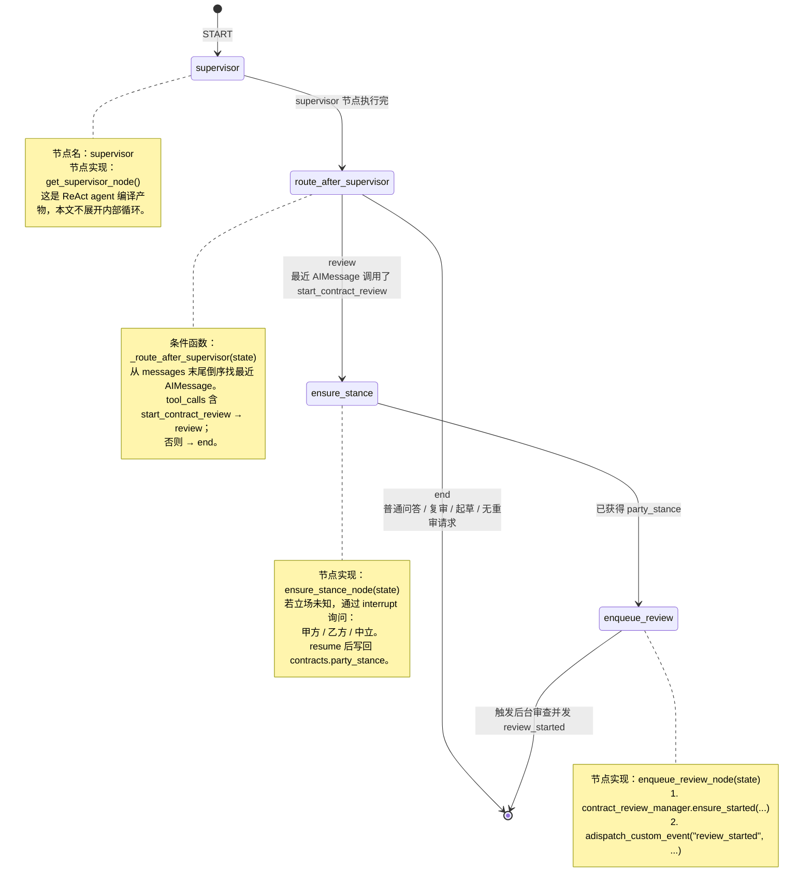
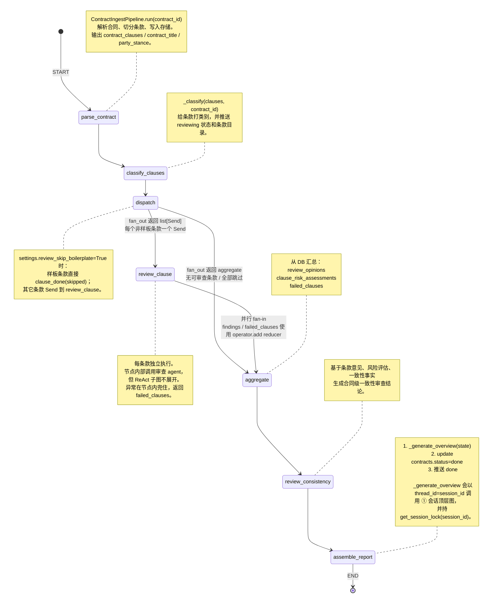
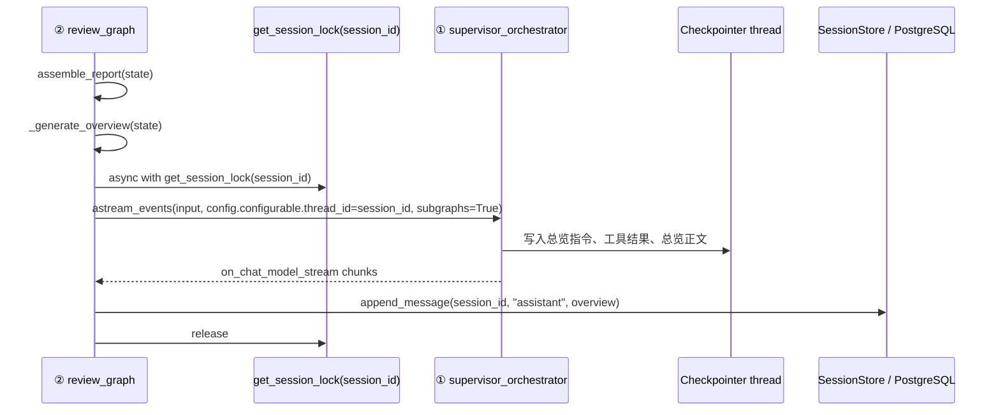

# Legal Flow LangGraph StateGraph 编排图

> 更新时间：2026-06-01
> 范围：只画两张显式 `StateGraph` 编排图：会话顶层图与合同审查流水线图。
> 说明：`create_agent(...)` 生成的 ReAct 子图不在本文展开，只作为普通节点或节点内部调用标注。

## 两张显式图

```mermaid
flowchart TB
    classDef graph fill:#e0f2fe,stroke:#0284c7,stroke-width:2px,color:#075985
    classDef caller fill:#f8fafc,stroke:#64748b,color:#334155
    classDef db fill:#ecfccb,stroke:#65a30d,color:#365314

    Upload["上传合同<br/>POST /contract-review<br/>只挂载到会话"]:::caller
    ChatRoute["/chat SSE<br/>app/api/routes/chat.py"]:::caller
    ReviewManager["review_manager 后台任务<br/>astream_review_job(contract_id)"]:::caller
    G1["① 会话顶层图<br/>supervisor_orchestrator<br/>build_supervisor_graph()"]:::graph
    G2["② 合同审查流水线图<br/>review_graph<br/>build_review_graph()"]:::graph
    DB["PostgreSQL / Checkpointer<br/>thread_id == session_id"]:::db

    Upload -->|"写 contracts.session_id<br/>不启动审查"| DB
    ChatRoute -->|"astream_events(v2)<br/>持 get_session_lock(session_id)"| G1
    G1 -->|"用户明确要求审查<br/>enqueue_review_node<br/>ensure_started(force_reset=True)"| ReviewManager
    ReviewManager -->|"astream(stream_mode=custom)"| G2
    G2 -->|"assemble_report / _generate_overview<br/>用 thread_id=session_id 调 ①"| G1
    G1 <--> DB
    G2 --> DB
```

## ① 会话顶层图：`supervisor_orchestrator`

文件：`app/agents/supervisor.py`
构造函数：`build_supervisor_graph(checkpointer=None)`
运行入口：`get_supervisor_agent()`，`/chat` 和审查总览生成都会调用它。



### `SupervisorState`

```python
class SupervisorState(AgentState):
    """顶层图与 supervisor 节点共享状态。"""

    # 继承自 AgentState；核心字段是 messages，由 LangGraph/AgentState 维护。
    # messages: list[BaseMessage]

    # 当前会话挂载的合同 id；由 /chat 的 extra_state 注入，也会随 checkpoint 进入线程状态。
    contract_id: NotRequired[int | None]

    # 委托人立场：甲方 / 乙方 / 中立 / None。
    # ensure_stance_node 会补齐未知立场，并落库给审查流水线使用。
    party_stance: NotRequired[str | None]
```

### 顶层图状态流转

| 节点 | 读取 State | 写入 State | 主要副作用 |
| --- | --- | --- | --- |
| `supervisor` | `messages`, `contract_id`, `party_stance` | `messages`，可能写入 `party_stance` | 调用法律工具、合同只读工具、`start_contract_review` 路由工具 |
| `_route_after_supervisor` | `messages` | 无 | 只做条件路由 |
| `ensure_stance` | `contract_id`, `party_stance`, `messages` | `party_stance` | 可能触发 `interrupt`，并写 `contracts.party_stance` |
| `enqueue_review` | `contract_id` | 无 | 启动审查后台任务，发送 `review_started` 自定义事件 |

## ② 合同审查流水线图：`review_graph`

文件：`app/contracts/review_graph.py`
构造函数：`build_review_graph()`
运行入口：`app/contracts/review_pipeline.py::astream_review_job(contract_id)`。该入口只能由会话顶层图的 `enqueue_review_node` 通过 `review_manager.ensure_started(...)` 间接启动；上传合同和直接订阅审查 SSE 都不会启动 pending 合同的审查。



### `ReviewState`

```python
class ReviewState(TypedDict):
    # 合同基础信息；astream_review_job 初始化，parse_contract 会刷新 title。
    contract_id: int
    contract_title: str
    session_id: str | None

    # 委托人立场：甲方 / 乙方 / 中立 / 未知。
    # 来自 contracts.party_stance，影响单条款审查和总览指令。
    party_stance: str

    # parse_contract 产出；后续节点只读。
    contract_clauses: list[ClauseRecord]

    # classify_clauses 产出：{clause_id: category}
    clause_categories: dict[str, str]

    # review_clause 并行分支输出，使用 operator.add 聚合。
    # 成功条款写入序列化审查意见。
    findings: Annotated[list[dict[str, Any]], operator.add]

    # review_clause 并行分支输出，使用 operator.add 聚合。
    # 单条失败不会让整图失败，而是汇总到这里。
    failed_clauses: Annotated[list[dict[str, Any]], operator.add]

    # review_consistency 产出：合同级一致性审查结果。
    consistency_review: dict[str, Any]

    # aggregate 产出：有风险条款数量。
    risk_count: int

    # aggregate 产出：最终报告摘要，包括风险分布、意见数、失败条款等。
    final_report: dict[str, Any]
```

### `ClauseTask`

`ClauseTask` 不是整图共享 State，而是 `dispatch -> review_clause` 的 `Send` 载荷。

```python
class ClauseTask(TypedDict):
    contract_id: int
    contract_title: str
    clause: ClauseRecord
    category: str
    party_stance: str
    focus_dimensions: list[str]
```

### 审查图节点状态流转

| 节点 | 读取 State | 写入 State | 主要副作用 / 事件 |
| --- | --- | --- | --- |
| `parse_contract` | `contract_id`, `contract_title` | `contract_clauses`, `contract_title`, `party_stance` | 解析合同；SSE `status(parsing)` |
| `classify_clauses` | `contract_clauses`, `contract_id` | `clause_categories` | 更新状态为 reviewing；SSE `status(reviewing, clauses[])` |
| `dispatch` | `contract_clauses`, `clause_categories` | 无 | 样板条款可直接 skipped；条件边生成 `Send` |
| `review_clause` | `ClauseTask` | `findings` 或 `failed_clauses` | 条款审查、落库意见/风险评估/一致性事实；SSE `clause_*` |
| `aggregate` | `contract_id`, `failed_clauses` | `risk_count`, `final_report` | 从 DB 汇总意见和风险评估 |
| `review_consistency` | `contract_id`, `contract_clauses`, `session_id` | `consistency_review` | 合同级一致性审查；SSE `consistency_*` |
| `assemble_report` | 全部 State | 无 | 总览写入 chat 线程，更新合同 done；SSE `overview_*`, `done` |

## 关键跨图调用

审查流水线图的 `assemble_report` 不再调用裸 ReAct 子图生成总览，而是通过会话顶层图生成总览。



同一把 `session_id` 级锁也包住 `/chat` 的 `stream_agent_as_sse(...)` 消费，因此后台总览和用户追问不会并发写同一个 checkpointer 线程。
